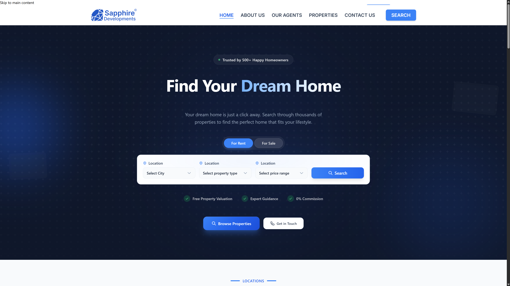
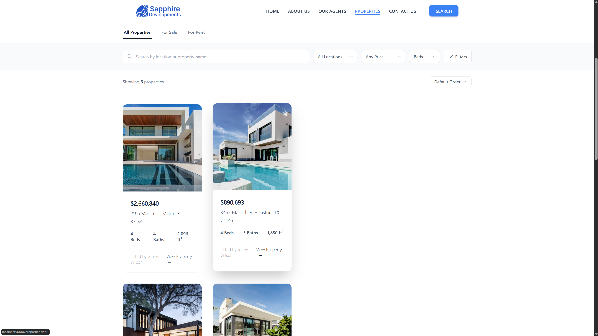
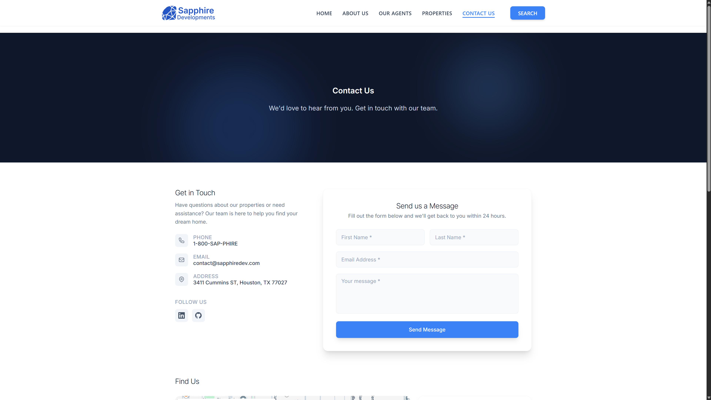

# Sapphire Developments

## 🏡 Luxury Real Estate Concept Platform

Sapphire Developments is a modern, responsive real estate concept website designed to showcase premium property listings, trusted agents, and high-end user experiences.

This project focuses on creating a **polished, conversion-oriented interface** that feels closer to a production-ready platform than a basic template or tutorial build.

---

## 🚀 Live Demo

👉 [View Live Site](https://sapphire-developments.vercel.app/)

---

## 🧠 Overview

The goal of this project was to design and develop a **luxury real estate experience** that emphasizes:

- Clean visual hierarchy
- Premium UI design
- Trust-building content (agents, stats, contact)
- Structured property browsing
- Responsive, mobile-first layouts

Rather than overloading the interface, the focus was on **intentional spacing, refined components, and cohesive design systems**.

---

## ✨ Features

- 🏠 Dynamic property listing sections (featured, rental, category-based)
- 🧑‍💼 Agent showcase pages with structured layouts
- 📍 Location-based browsing (properties by city)
- 📊 Trust-building stats and feature sections
- 📬 Conversion-focused contact page with refined form UI
- 📱 Fully responsive design across all screen sizes
- ⚡ Smooth navigation using React Router
- 🎯 Clean UI system with consistent spacing, typography, and components

---

## 🛠 Tech Stack

- **Frontend:** React (Create React App)
- **Routing:** React Router DOM
- **Styling:** Tailwind CSS
- **Build Tooling:** react-scripts (CRA)
- **Deployment:** Vercel

---

## 🧩 Key Improvements & Refinements

This project went through multiple refinement passes focused on:

- Improving layout consistency across all pages
- Enhancing card design and visual hierarchy
- Removing unnecessary or redundant sections (e.g. Gallery)
- Fixing console warnings and React key issues
- Strengthening form UX and contact flow
- Unifying spacing, shadows, and component structure
- Adding branded footer with developer attribution

---

## 📁 Project Structure

```bash
src/
├── components/
├── pages/
├── App.js
├── index.js
```

The project follows a **component-based architecture** with reusable UI patterns and clearly separated page structures.

---

## ⚙️ Installation & Setup

Clone the repository:

```bash
git clone https://github.com/Jeremy-Jefferson/Sapphire-Developments.git
cd Sapphire-Developments
```

Install dependencies:

```bash
npm install
```

Run locally:

```bash
npm start
```

Build for production:

```bash
npm run build
```

---

## 🌐 Deployment

This project is deployed using **Vercel** with a standard Create React App build configuration.

A `vercel.json` file is included to support SPA routing:

```json
{
  "rewrites": [
    {
      "source": "/(.*)",
      "destination": "/index.html"
    }
  ]
}
```

---

## 🎯 Goals of This Project

- Build a **portfolio-level real estate platform**
- Demonstrate strong **UI/UX decision-making**
- Showcase **frontend architecture and component design**
- Create something that feels like **real client work**

---

## 👨‍💻 Author

**Jeremy Jefferson**
Designed & Built by **Hungry Ghost DEV**

---

## 📌 Notes

This is a concept project intended for portfolio and demonstration purposes.


👉 [View Live Site](https://sapphire-developments.vercel.app/)

---

## 📸 Screenshots




``

```

```
